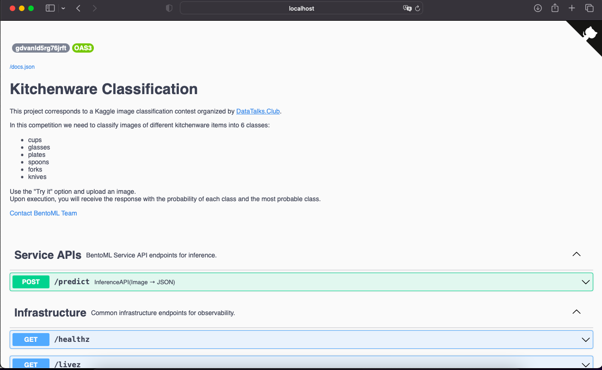
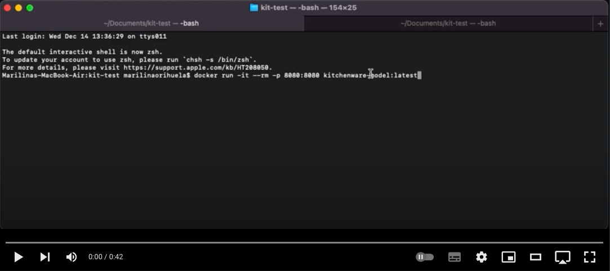
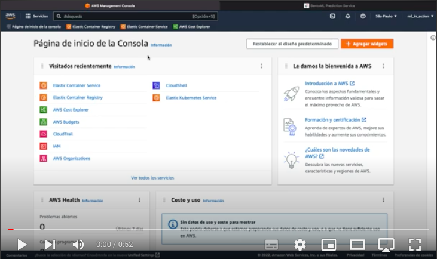

# Kitchenware Classification

This project corresponds to a Kaggle image classification contest organized by [DataTalks.Club](https://www.kaggle.com/competitions/kitchenware-classification/overview).

In this competition we need to classify images of different kitchenware items into 6 classes:

* cups
* glasses
* plates
* spoons
* forks
* knives

I experimented with different deployment ways for this model.
<To test it online I made this development with Fast Api to upload it to mogenius. Which allowed me to add a telegram bot.>

### [Telegram Bot](https://github.com/mary435/Telegram/tree/main/kitchenware) for Kitchenware Classification Model

### Try the model locally with BentoML:
```
docker pull maryorihuela/kitchenware-classification:gdvanld5rg76jrft 
docker run -it --rm -p 3000:3000 maryorihuela/kitchenware-classification:gdvanld5rg76jrft serve --production
```
* Just go to localhost:3000 and test it by uploading an image.
* Video of the model running locally with BentoML:
[](https://youtu.be/5TP-wYtBy_s) 

### Try the model locally without BentoML:
* Download docker and run it: 
```
docker pull maryorihuela/kitchenware-model:latest 
docker run -it --rm -p 8080:8080 maryorihuela/kitchenware-model:latest 
```
* Download [test.py](test.py)
* Run: ```python3 test.py ```
* For testing diferent images use a url after the fine name e.g.: ```python3 test.py https://raw.githubusercontent.com/mary435/kitchenware_classification/main/images/0040.jpg```
* I uploaded some images in my repository to test, but you can put any url.
```
https://raw.githubusercontent.com/mary435/kitchenware_classification/main/images/0017.jpg
https://raw.githubusercontent.com/mary435/kitchenware_classification/main/images/0022.jpg
https://raw.githubusercontent.com/mary435/kitchenware_classification/main/images/0034.jpg
https://raw.githubusercontent.com/mary435/kitchenware_classification/main/images/0036.jpg
https://raw.githubusercontent.com/mary435/kitchenware_classification/main/images/0040.jpg
https://raw.githubusercontent.com/mary435/kitchenware_classification/main/images/6172.jpg
```  
* Video of the model running Locally:
[](https://youtu.be/b1L8uhEvEWQ) 


## Data: 
 * Download from [Kaggle contest](https://www.kaggle.com/competitions/kitchenware-classification/data).
 * API from Kaggle:  ```kaggle competitions download -c kitchenware-classification```
 
## [Notebook.ipynb](notebook.ipynb):
The notebook was created with this anaconda environment: [model.yaml](model.yaml)

Download it and import it to your anaconda, option environments, import.

Next, open the jupyter Notebook file and run it to view the EDA analyzes, training of differents models, selection process and parameter tuning.

## [Train.py](train.py):

Script to training the final model and save it.
To run this script in addition to the dataset saved at the same folder, you need the environment:

* Anaconda: [model.yaml](model.yaml) ```python3 test.py```
* Pipenv: [Pipfile](Pipfile) and [Pipfile.lock](Pipfile.lock) ```pipenv python3 test.py```

## Lambda Function:
 * To develop it need the kitchenware-model.h5 from train.py. Download and run this script [keras_to_tflite.py](keras_to_tflite.py) to save the model 'kitchenware-model.h5' to a lambda model file: kitchenware-model.tflite.    
Run: ```python3 keras_to_tflite.py``` OR ```pipenv python3 keras_to_tflite.py```    
 
 * Download this files:
     * [lambda_function.py](lambda_function.py)
     * [dockerfile](dockerfile)

 * Run this command: 
```
docker build -t kitchenware-model .
docker run -it --rm -p 8080:8080 kitchenware-model:latest
```
 * To try it locally download this file: [test.py](test.py) And run ```python3 test.py``` OR ```pipenv python3 test.py```


* [AWS Lambda configuration](AWS-Lambda-configuration.md)

* Video of the model running on AWS Lambda:
[](https://youtu.be/ZKhc76kcJos) 

## Deploy on Kubernetes:

1. To develop it need the kitchenware-model.h5 from train.py.
2. Convert the model:

> ipython
```
import tensorflow as tf
from tensorflow import keras
model = keras.models.load_model('kitchenware-model.h5')
tf.saved_model.save(model, 'kitchenware-model')
```
> exit ipython
```
saved_model_cli show --dir kitchenware-model --all
```
3. Find and copy the second signature: signature_def to model-description.txt
```
signature_def['serving_default']:
  The given SavedModel SignatureDef contains the following input(s):
    inputs['input_45'] tensor_info:
        dtype: DT_FLOAT
        shape: (-1, 299, 299, 3)
        name: serving_default_input_45:0
  The given SavedModel SignatureDef contains the following output(s):
    outputs['dense_35'] tensor_info:
        dtype: DT_FLOAT
        shape: (-1, 6)
        name: StatefulPartitionedCall:0
  Method name is: tensorflow/serving/predict
```  
4. Save this values:  
``` 
    serving_default
    input_45 - input
    dense_35 - output
```
5. Run the model: 
```
docker run -it --rm -p 8500:8500 -v "$(pwd)/kitchenware-model:/models/kitchenware-model/1" -e MODEL_NAME="kitchenware-model" tensorflow/serving:2.7.0 
```
Now will see a message like: "[evhttp_server.cc : 245] NET_LOG: Entering the event loop ..."

6. tf-serving-connect: open [tf-serving-connect.ipynb](tf-serving-connect.ipynb) and run it to test the running model.    

7. Run: ```jupiter nbconvert --tosript tf-serving-connect.ipynb``` and clear the file to run as script with: ```python3 tf-serving-connect.py```      
 
8. Convert this script to a Flask app: Add the flask configration to the tf-serving-connect.py and save it to gateway.py or download the following files already configured.   
          - [gateway.py](gateway.py).    
          - [test.py](test.py).     
          - [proto.py](proto.py).     
          
Test it running ```python3 gateway.py```. 
Now that gateway is running with flask, in another window: ```python3 test.py``` .
The model answers the most probable class.


### Docker compose:

1. Prepare the environment with pipenv: 
```
pipenv --python 3.9
pipenv install grpcio ==1.42.0 flask gunicorn keras-image-helper tensorflow-protobuf==2.11.0
```             
   * Or download from here: [Pipfile](kube-config/Pipfile) [Pipfile.lock](kube-config/Pipfile.lock) And run ```pipenv install```

2. Download the file: [image-model.dockerfile](image-model.dockerfile). And run:     
```
docker build -t kitchenware-model:xception-v4-001 -f image-model.dockerfile .
docker run -it --rm -p 8500:8500 kitchenware-model:xception-v4-001
``` 
   * Or download and run:
```
docker push maryorihuela/kitchenware-model:xception-v4-001
docker run -it --rm -p 8500:8500 maryorihuela/kitchenware-model:xception-v4-001
``` 

3. For testing comment the line ```app.run(debug=True, host='0.0.0.0', port=9696)``` on gateway.py. And run ```pipenv run python3 gateway.py```.   

4. Now uncomment the line ```app.run(debug=True, host='0.0.0.0', port=9696)``` on gateway.py. 
And comment the first tree:
``` 
url = 'https://raw.githubusercontent.com/mary435/kitchenware_classification/main/images/6172.jpg'  
response = predict(url)    
print(response)
```   
5. Download the file: [image-gateway.dockerfile](image-gateway.dockerfile) And run:
```
docker build -t kitchenware-gateway:001 -f image-gateway.dockerfile .
docker run -it --rm -p 9696:9696 kitchenware-gateway:001
```        
* Or download and run:
```
docker push maryorihuela/kitchenware-gateway:001
docker run -it --rm -p 8500:8500 maryorihuela/kitchenware-gateway:001
``` 

6. Download docker compose file: [docker-compose.yaml](docker-compose.yaml)    
    * Run: ```docker-compose up```
    * Test: ```python3 test.py```
    * Option detached mode: ```docker-compose up -d``` And Off: ```docker-compose down```

### Kubernetes:

1. Install kubectl: search on google "kubectl AWS" and install from the link instructions. Same for "kind" and follow the instructions for your OS.

2. New folder: kube-config: Download the file [model-deployment.yaml](kube-config/model-deployment.yaml)
```
kind load docker-image kitchenware-model:xception-v4-001
cd kube-config/
kubectl apply -f model-deployment.yaml
kubectl get pod
kubectl port-forward tf-serving-kitchenware-model-#add_here_the_id# 8500:8500
```
3. Testing: comment the line ```app.run(debug=True, host='0.0.0.0', port=9696)``` on gateway.py, and uncomment the other tree lines. Run ```pipenv run python3 gateway.py```.   

4. Download the file: [model-service.yaml](kube-config/model-service.yaml) 
```
kubectl apply -f model-service.yaml
kubectl get service
kubectl port-forward service/tf-serving-kitchenware-model 8500:8500
```
5. Test ```pipenv run python3 gateway.py```. 

6. Download the file: [gateway-deployment.yaml](kube-config/gateway-deployment.yaml) 
```
kind load docker-image kitchenware-gateway:001
kubectl get pod
kubectl apply -f gateway-deployment.yaml
kubectl get pod

kubectl port-forward gateway-#add_here_the_id# 9696:9696
```
7. Test ```python3 test.py```

8. Download the file: [gateway-service.yaml](kube-config/gateway-service.yaml) 
```
kubectl apply -f gateway-service.yaml
kubectl get service
kubectl port-forward service/gateway 8080:80
```
9. Test.py change the url to 8080 ```python3 test.py```

### Deploying to EKS: [AWS-EKS-configuration.md](AWS-EKS-configuration.md):


* Video of the model running on AWS EC2:
[](https://youtu.be/OoW0ckc-2Sw)


## License

Distributed under the terms of the [MIT license](https://opensource.org/licenses/MIT), "kitchenware_classification" is free and open source software.


## 
